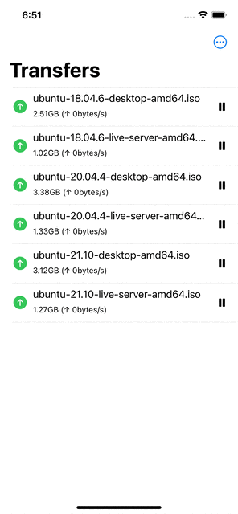

# SwiftTorrent (개인 프로젝트)

QBittorrent 클라이언트 원격 제어용 앱.

사용한 API: https://github.com/qbittorrent/qBittorrent/wiki/WebUI-API-(qBittorrent-4.1)

## 사용된 기술

- SwiftUI
- Combine
- Swift 5.5 async / await
- URLSession
- URL Scheme / File Extension

## 구현 내용

### 로그인 / 로그아웃

오류 발생 시 메시지가 표시된다.

### Swipe Action (삭제)

### Edit Multiple Files

### Import Files and Links

File Importer(Document Picker)를 사용한 파일 불러오기

클립보드에서 바로 붙여넣어 마그넷 추가하기

### Custom URL Scheme and File Exetension Support

### Sort by Options

다양한 상태 기반으로 정렬이 가능하며 동일메뉴 재선택 시 오름차순/내림차순 전환
